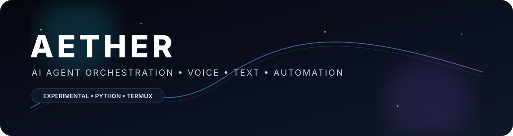

# AETHER

<p align="center">
  
</p>

<p align="center">
  <strong>Experimental voice/text-driven meta-orchestrator for coordinating AI agents under explicit capabilities, approvals, and observability.</strong>
</p>

<p align="center">
  <a href="https://github.com/agastyatomar/AETHER/actions/workflows/ci.yml"></a>
  <a href="LICENSE"></a>
  
  
  
</p>

> **Status:** Alpha. APIs, agent contracts, browser integration, and installation behavior can change between releases.

## What is AETHER?

AETHER is a Python orchestration framework for turning a natural-language request into a controlled workflow of cooperating agents. The project focuses on explicit capabilities, approval gates, persistent state, telemetry, and tool execution rather than unrestricted autonomous access.

### Core capabilities

- **Agent society** — named agents, rooms, roster, scheduling, memory, and relationships.
- **Tool execution** — centralized execution paths with capability and approval controls.
- **Skills** — reusable skill manifests, registry, authoring, and runners.
- **Browser automation** — optional Playwright/browser-use integration where the platform supports it.
- **Telemetry** — flight-recording style events, latency data, and replay-oriented diagnostics.
- **Web API** — FastAPI endpoints for health, version, commands, and orchestration.
- **Termux support** — an Android-focused installer with a fast path and platform-specific dependency handling.

## Architecture

```text
User
 │
 ├── voice / text
 ▼
AETHER CLI / Web API
 │
 ▼
Orchestrator
 ├── approvals & capability checks
 ├── scheduler
 ├── tool executor
 ├── skills
 └── agent society
      ├── agents
      ├── rooms
      ├── memory
      └── telemetry
```

The design goal is to keep powerful actions behind explicit execution boundaries instead of allowing arbitrary work to happen during import or startup.

## Quick start

### Linux / macOS / WSL

```bash
curl -fsSL https://raw.githubusercontent.com/agastyatomar/AETHER/main/install.sh | bash
aether --help
```

### Termux / Android

The default Termux path is intentionally fast: it avoids a full `pkg upgrade` and installs only missing prerequisites.

```bash
curl -fsSL https://raw.githubusercontent.com/agastyatomar/AETHER/main/install-termux.sh | bash
aether --help
```

For the full Termux package refresh:

```bash
curl -fsSL https://raw.githubusercontent.com/agastyatomar/AETHER/main/install-termux.sh | bash -s -- --full
```

### Manual

```bash
git clone --depth 1 https://github.com/agastyatomar/AETHER.git
cd AETHER
python -m venv .venv
source .venv/bin/activate
python -m pip install -e .
aether --help
```

## Termux / Android dependency note

AETHER uses **Pydantic 2**. The normal PyPI package publishes wheels for common desktop/server platforms, but Termux identifies itself as Android and does not receive those Android-specific `pydantic-core` wheels. Building that Rust extension locally can be slow or fail because of the native toolchain.

The installer therefore uses an Android wheel path for supported Python versions and a project-maintained Android-wheel workflow for newer Python releases. It does **not** silently downgrade AETHER to Pydantic 1 because the codebase uses Pydantic 2 APIs.

If your Termux environment reports a native-build error, capture the complete error before retrying repeatedly.

## Usage

```bash
# Discover commands
aether --help

# Run a request
aether run "your request"

# Agent society
aether-society roster
aether-society --help
```

### Web server

```bash
python -m aether.web.server
```

Health endpoint:

```text
http://127.0.0.1:8080/api/health
```

For public deployments, put AETHER behind an authenticated and appropriately sandboxed deployment boundary. Do not expose unrestricted command execution to the public internet.

## Repository layout

```text
AETHER/
├── aether/
│   ├── core/              # Core infrastructure
│   ├── society/           # Agent society and runtime
│   ├── skills/            # Skill system
│   ├── docs/              # Documentation/search layer
│   ├── telemetry/         # Events and diagnostics
│   └── cli.py             # CLI entry point
├── tests/                 # Unit, contract, and integration tests
├── .github/workflows/     # CI and platform workflows
├── install.sh             # Linux/macOS/WSL installer
├── install-termux.sh      # Termux installer
├── pyproject.toml         # Package metadata
├── requirements.txt       # Runtime dependencies
├── SECURITY.md            # Security policy
└── README.md
```

## Testing

```bash
pytest
pytest --cov=aether --cov-report=term-missing
ruff check .
ruff format --check .
```

The repository's CI also validates packaging/install scripts and Docker builds on supported CI targets.

## Safety model

AETHER is designed around explicit control boundaries:

1. **No initialization at import** — startup work should be explicit.
2. **Tool-executor gating** — agent actions should pass through the execution layer.
3. **Approval gates** — sensitive operations can require explicit approval.
4. **Capability ceilings** — agents should only receive declared capabilities.
5. **Auditability** — events and telemetry support debugging and review.
6. **Public-demo isolation** — public demos should disable or sandbox dangerous execution paths.

These controls are engineering mechanisms, not a guarantee that every deployment is safe. Review skills, plugins, MCP servers, browser actions, credentials, and permissions before enabling them.

## Documentation

- [Architecture](docs/architecture.md)
- [Agent Society](docs/agent-society.md)
- [Browser Automation](docs/browser-automation.md)
- [Skills](docs/skills.md)
- [Telemetry](docs/telemetry.md)
- [API](docs/api.md)
- [Security Policy](SECURITY.md)
- [Changelog](CHANGELOG.md)

## Development

```bash
git clone https://github.com/YOUR_USERNAME/AETHER.git
cd AETHER
python -m venv .venv
source .venv/bin/activate
python -m pip install -e ".[dev]"
pytest
ruff check .
```

Please keep changes focused, add tests for behavior changes, and avoid committing credentials or generated secrets.

## License

MIT — see [LICENSE](LICENSE).

---

<p align="center">
  <sub>Built and maintained by Agastya Tomar (Aadi) • AETHER Alpha</sub>
</p>
